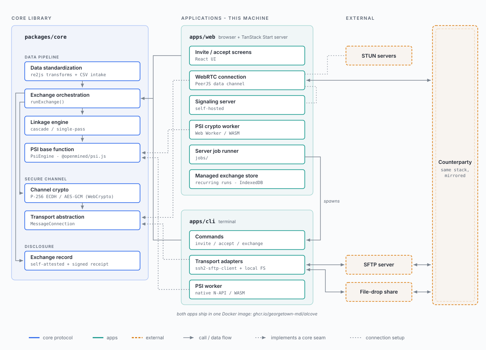

# psilink documentation

psilink is a privacy-preserving record linkage (PPRL) tool that enables partner agencies to identify shared members across administrative datasets without revealing anything about the records they do not have in common. It implements a private set intersection (PSI) protocol available both as a browser-based web application and a containerized CLI, and is designed to work within the policy and infrastructure constraints typical of government agencies.

## Role-based reading guide

| I am a... | Start with... | Then read... |
|-----------|--------------|--------------|
| Program officer evaluating the software | [DESIGN.md](DESIGN.md) | [SECURITY_DESIGN.md](SECURITY_DESIGN.md), [COMPLIANCE.md](COMPLIANCE.md) |
| Security reviewer or auditor | [SHARED_RESPONSIBILITY.md](SHARED_RESPONSIBILITY.md) | [SECURITY_DESIGN.md](SECURITY_DESIGN.md), [PROTOCOL.md](spec/PROTOCOL.md), [CHANNEL_SECURITY.md](spec/CHANNEL_SECURITY.md), [COMPLIANCE.md](COMPLIANCE.md) |
| Compliance officer | [COMPLIANCE.md](COMPLIANCE.md) | [PRIVACY.md](../PRIVACY.md), [SECURITY_DESIGN.md](SECURITY_DESIGN.md) |
| Privacy reviewer | [PRIVACY.md](../PRIVACY.md) | [COMPLIANCE.md](COMPLIANCE.md), [SECURITY_DESIGN.md](SECURITY_DESIGN.md) |
| IT professional operationalizing an exchange | [CLI.md](CLI.md) | [EXCHANGE_REFERENCE.md](EXCHANGE_REFERENCE.md), [DEPLOYMENT.md](DEPLOYMENT.md) |
| Operator running one exchange from a graphical console on their own machine | [CONSOLE.md](CONSOLE.md) | [CLI.md](CLI.md), [EXCHANGE_REFERENCE.md](EXCHANGE_REFERENCE.md) |
| Operator running a recurring exchange from the browser | [MANAGED_EXCHANGE.md](MANAGED_EXCHANGE.md) | [SECURITY_DESIGN.md](SECURITY_DESIGN.md), [MANAGED_EXCHANGE_RECORD.md](spec/MANAGED_EXCHANGE_RECORD.md) |
| Developer contributing to the project | [DESIGN.md](DESIGN.md) | [PROTOCOL.md](spec/PROTOCOL.md), [COMMUNICATION.md](COMMUNICATION.md), [FILE_SYNC.md](spec/FILE_SYNC.md), [CONTRIBUTING.md](../CONTRIBUTING.md), [TESTING.md](TESTING.md) |
| Maintainer upgrading a pinned dependency | [CONTRIBUTING.md](../CONTRIBUTING.md#dependency-policy) | [DEPENDENCY_PINS.md](spec/DEPENDENCY_PINS.md), [PREBUILD_REVENDOR.md](PREBUILD_REVENDOR.md) |
| Partner agency setting up an exchange | [CLI.md](CLI.md) | [EXCHANGE_REFERENCE.md](EXCHANGE_REFERENCE.md) |

## Document inventory

The documentation is organized in three tiers: this **overview** tier (`docs/`) of conceptual and operational documents; a **technical specification** tier ([`docs/spec/`](spec/README.md)) of wire formats, byte encodings, normative constants, and implementation-level design for implementors and auditors; and a **design notes** tier ([`docs/notes/`](notes/README.md)) of citeable, non-normative design records -- the model behind a mechanism, the options weighed, and the decisions taken. The spec and notes tiers each have their own index.

### Overview (`docs/`)

- [DESIGN.md](DESIGN.md) - project overview, architecture, exchange specification summary, and high-level user journey
- [SECURITY_DESIGN.md](SECURITY_DESIGN.md) - security overview, the private set intersection (PSI) privacy guarantee, threat model, authentication design, channel security, and key rotation
- [MANAGED_EXCHANGE.md](MANAGED_EXCHANGE.md) - the managed (recurring) web exchange lifecycle: who it serves, the automation goal and its platform envelope, the second-run journey, durability contract, single-device ownership, desync recovery, storage-eviction survival, the export/import credential file, and the moment-anchored backup surfaces
- [SHARED_RESPONSIBILITY.md](SHARED_RESPONSIBILITY.md) - the deployment model and the responsibility split between the project and the deploying agency, per deployment, with the recurring security-questionnaire answers
- [COMPLIANCE.md](COMPLIANCE.md) - regulatory framings, data classification, and considerations for agency reviewers
- [COMMUNICATION.md](COMMUNICATION.md) - channels, synchronization, error handling, and supporting services
- [EXCHANGE_REFERENCE.md](EXCHANGE_REFERENCE.md) - complete field-level reference for exchange specification files
- [CLI.md](CLI.md) - CLI commands, configuration files, invitation strings, and recovery
- [DEPLOYMENT.md](DEPLOYMENT.md) - operating supporting services and Docker deployment of the CLI
- [CONSOLE.md](CONSOLE.md) - the local, single-operator graphical front end to the containerized CLI: running the container, the mounts and environment variables, where to publish its port, what an operator authors in it, and graduating a prototyped exchange to a scheduled CLI run
- [FIPS_SFTP_PROFILE.md](FIPS_SFTP_PROFILE.md) - the SFTP deployment profile for agencies required to use FIPS-approved cryptography: the algorithm settings, what they exclude, and the host-key gap
- [RELEASES.md](RELEASES.md) - versioning policy, release checklist, and artifact publication
- [PREBUILD_REVENDOR.md](PREBUILD_REVENDOR.md) - replacing the vendored native PSI prebuild: the two integrity controls, the ordered procedure, and the chain-of-custody steps a reviewer performs
- [INCIDENT_RESPONSE.md](INCIDENT_RESPONSE.md) - the responder's runbook behind [SECURITY.md](../SECURITY.md): triage and severity, affected versions, the private fix and hotfix release, advisory and CVE publication, reporter communication, the maintainer-unavailable path, and the tabletop exercise record
- [TESTING.md](TESTING.md) - test-suite reference: where a test goes, integration backends and profiles, the console sentinel, the browser suite, and the coverage rationale
- [ROADMAP.md](ROADMAP.md) - roadmap of planned functionality

### Technical specifications ([`docs/spec/`](spec/README.md))

- [PROTOCOL.md](spec/PROTOCOL.md) - PSI and PSI-C algorithms, linkage mechanics, datasets, post-linkage steps, and P-256 key-exchange wire-level specification
- [CHANNEL_SECURITY.md](spec/CHANNEL_SECURITY.md) - application-layer AEAD construction, the transport memory/liveness bounds, SFTP fatal-packet crash safety, and the authenticated abort marker
- [FILE_SYNC.md](spec/FILE_SYNC.md) - file-sync transport state model: the directory-as-state-machine, filename taxonomy, enforcement sites, invariants, and exchange preconditions for the `sftp` and `filedrop` channels
- [WEBRTC_TRANSPORT.md](spec/WEBRTC_TRANSPORT.md) - the `webrtc` channel's wire, which the browser and CLI ends must match exactly: the rendezvous roles, the signaling payload shapes, the data-channel chunk envelope and close sentinel, the ICE list-replaces-default rule, and the transport's budgets
- [EXCHANGE_RECORD.md](spec/EXCHANGE_RECORD.md) - format specification for the self-attested exchange record: file shapes, commitment scheme, governance metadata, and privacy properties
- [EXCHANGE_FILE.md](spec/EXCHANGE_FILE.md) - the downloadable exchange-file artifact's compatibility contract: that a minted file is the shared CLI config schema, the mint-layer guarantees, the web/CLI versioning policy, the invitation channel-binding rule, and the secret's key-file provisioning path
- [DEFAULT_STANDARDIZATION.md](spec/DEFAULT_STANDARDIZATION.md) - the per-type default cleaning pipelines applied when a configuration authors no `standardization`, the cross-party invariant behind them, and the column-name table that infers a semantic type, role, and payload default
- [CANONICAL_ENCODING.md](spec/CANONICAL_ENCODING.md) - the RFC 8785 byte encoding the receipts, record commitments, and agreed-terms hash are computed over
- [CREDENTIAL_STORAGE.md](spec/CREDENTIAL_STORAGE.md) - the owner-only write path (exclusive-create, atomic rename, fsync durability, ACL narrowing) for the key file, signing identity, exchange record, and result CSV
- [MANAGED_EXCHANGE_RECORD.md](spec/MANAGED_EXCHANGE_RECORD.md) - the browser-persisted managed-exchange record: the persisted exchange-file document plus local fields, the persist-before-success ordering, the linear-secret single-owner invariant, and the export artifact's custody model and CLI-separable format
- [CLI_EVENTS.md](spec/CLI_EVENTS.md) - the CLI's opt-in machine-interface event stream (`--event-stream`): the file descriptor, NDJSON framing, event types, terminal-error categories, and per-field sanitization
- [CLI_DOCTOR.md](spec/CLI_DOCTOR.md) - the `psilink doctor` verdict under `--json`: the document's fields, the schema version and compatibility rule, the status and `overall` vocabularies, both modes' fixed check lists, and the exit-code mapping
- [SERVER_JOB_API.md](spec/SERVER_JOB_API.md) - the web server's job API that drives the CLI as a subprocess for the console: endpoints, the injection-closed intent schema, the operator-authored SFTP connection, the single-active-exchange lifecycle, the workdir layout, the SSE event relay, and the gate/startup rules (the console facilitates one exchange at a time; a second create is refused until it is deleted, and a restart forgets it)
- [DEPENDENCY_PINS.md](spec/DEPENDENCY_PINS.md) - why the SFTP and WebRTC stacks are exact-pinned, their internal assumptions, the per-stack upgrade checklists, and the `allowScripts` install-script policy
- [CONTAINER_IMAGES.md](spec/CONTAINER_IMAGES.md) - how the shipped CLI image and its FIPS variant freeze their npm tree to the committed lockfile and what each pins by digest, hash, or NVR, what the CMVP certificate behind the FIPS provider attests, and the writable-set and setuid/setgid inventories measured on the built images

### Design notes ([`docs/notes/`](notes/README.md))

Tracked, citeable design records: the model behind a mechanism, the options weighed, and the decisions taken. Nothing here binds an implementation; a note points at the spec for the normative rows. Its [index](notes/README.md) lists each note with its status and holds the maturity ladder from `scratch/` up to the formal tiers.

The web application's interface has its own record outside this tree: [`design/web-redesign/`](../design/web-redesign/README.md) holds the chosen redesign as a non-functional HTML mockup, with the framing, the alternatives weighed, and the civic-design sourcing behind it -- the direction `apps/web/src/bench/` implements.

## System architecture

One library, `packages/core`, holds the protocol; the apps supply what core leaves abstract - the transport channel (`MessageConnection`) and the PSI compute backend (`PsiEngine`). Both apps ship in one Docker image. [DESIGN.md](DESIGN.md) narrates this architecture; the [spec tier](spec/README.md) holds the wire-level detail.
